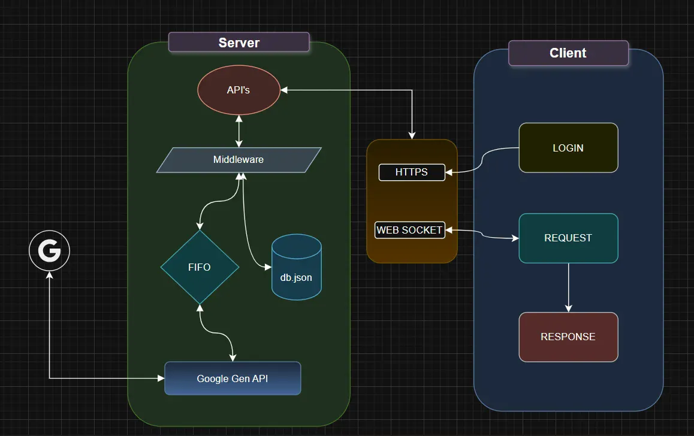

# Google Gen AI API Integration

## 🎯 Overview

This application provides api's for code suggestion system where users can submit code snippets and receive AI-generated suggestions for improvements, bug fixes, and best practices. The system uses a **FIFO (First-In-First-Out) queue** to handle multiple concurrent requests efficiently, ensuring fair processing for all users.

### Key Highlights:

- ✅ Real-time WebSocket communication
- ✅ Session-based authentication
- ✅ FIFO queue for managing concurrent requests
- ✅ Google Gemini AI integration
- ✅ Support for up to 5 concurrent users (POC)

---

## Architecture



### System Components:

#### 1. **Client Layer**
- **Browser Interface**: HTML/CSS/JavaScript frontend
- **WebSocket Client**: Socket.IO client for real-time communication

#### 2. **Server Layer**
- **Express.js Server**: Handles HTTP requests and serves static files
- **Socket.IO Server**: Manages WebSocket connections
- **Session Middleware**: Validates and manages user sessions
- **Queue Service**: FIFO queue implementation for request management

#### 3. **External Services**
- **Google Gemini API**: AI model for code analysis and suggestions

#### 4. **Data Storage**
- **db.json**: File-based storage for users and sessions (POC)

---


## 📦 Installation

### Prerequisites
- Node.js v18 or higher
- npm or yarn
- Google Gemini API Key ([Get it here](https://aistudio.google.com/app/apikey))

### Steps

1. **Clone the repository**
```bash
git clone <repository-url>
cd code-suggestion-system
```

2. **Install dependencies**
```bash
npm install
```

3. **Create environment file**
```bash
# Create .env file in root directory
touch .env
```

4. **Configure environment variables**
```env
GEMINI_API_KEY=your_gemini_api_key_here
PORT=3000
```

5. **Verify db.json exists**
```bash
# db.json should contain initial users
cat db.json
```

6. **Start the server**
```bash
npm start
```

7. **Open test client**
```bash
# Open index.html in your browser
open index.html
```


### Test Users

| Username | Password | Role |
|----------|----------|------|
| alice | password123 | developer |
| bob | password456 | developer |
| charlie | password789 | developer |
| david | password321 | admin |
| eve | password654 | developer |


## ⚠️ Limitations

### Current POC Limitations

1. **Storage**: File-based storage (db.json) - not suitable for production
2. **Scalability**: Single server instance, no load balancing
3. **Security**: Passwords stored in plain text
4. **API Limits**: Gemini API free tier has rate limits
5. **Max Users**: Designed for 5 concurrent users
6. **No Persistence**: Queue lost on server restart
7. **No Authentication**: Basic username/password only

### Gemini API Limits (Free Tier)

- 15 requests per minute
- 1 million tokens per day
- 1,500 requests per day

---
